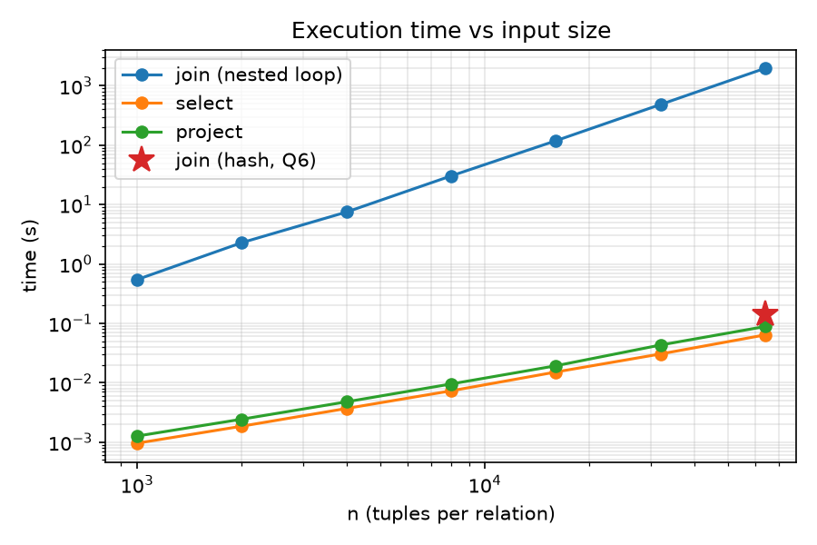
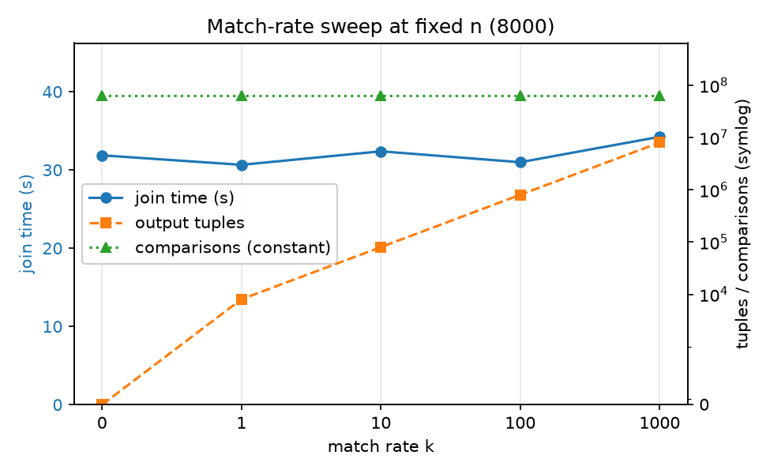

# Performance report

## Setup

- Machine: Apple M2, 8 cores, 16 GB RAM, macOS 26.5.2
- Language: Python 3.12.1 (CPython, arm64), engine is standard library only
- Engine: fused nested loop join, no indexes, no optimisation (Q6 switches strategy)
- Timing method: `perf_counter_ns` around **execution only**, median of 3 runs for
  n <= 8000 and a single run above that, GC disabled during the timed region.
  The timed region pulls the result stream to completion, so every operator's work is
  included.
- The "load" column is measured separately and covers data *generation plus* catalog
  load (it wraps `build_catalog`), so it is an upper bound on parse-and-load cost.
- Data generator: `bench/gen.py --n N --m N --match-rate k --seed 42`.
  `a` and `c` are unique ids, so no tuple collapses under set semantics and the real
  `n` is what the formulas assume. The `b` domain has size `m/k`, so each R tuple
  matches about `k` S tuples and the output is about `n*k`.
  `k = 0` draws the two `b` domains disjointly, so the join compares every pair and
  emits nothing. These three properties are asserted in `tests/test_bench.py` rather
  than assumed.
- Runner: `uv run python bench/run_experiment.py --sizes 1000,...,64000 --out bench/results.csv`
  (one detached background process, ~48 min wall clock; Q1 is asserted per row and the
  two join strategies are asserted to return the same number of rows).
- Raw data: `bench/results.csv`, run log `bench/full_run.log`, derived numbers from
  `uv run python bench/analyze.py`.

## Join experiment

Query: `R join[R.b=S.b] S`, k = 1.

| n | m | comparisons | wall time (s) | output tuples |
|---|---|---|---|---|
| 1000 | 1000 | 1,000,000 | 0.5455 | 961 |
| 2000 | 2000 | 4,000,000 | 2.2830 | 1,975 |
| 4000 | 4000 | 16,000,000 | 7.4763 | 3,995 |
| 8000 | 8000 | 64,000,000 | 30.3663 | 8,057 |
| 16000 | 16000 | 256,000,000 | 118.7466 | 16,294 |
| 32000 | 32000 | 1,024,000,000 | 483.9691 | 31,969 |
| 64000 | 64000 | 4,096,000,000 | 1973.6253 | 64,033 |

Load time for reference: 0.035, 0.064, 0.110, 0.219, 0.465, 0.933 and 1.911 s for the
seven sizes.
Loading is linear in `n` and utterly dominated by execution: at n = 64000 the load is
1.9 s against 1974 s of join, i.e. under 0.1 %.



## Questions

### Q1. Relationship between n, m and the comparison count

**comparisons = n · m exactly**, with no dependence on the data.

The reason is structural.
The fused nested loop walks every left tuple against every right tuple and evaluates
the condition once per pair, and there is no early exit: a θ-join has to find *all*
matching partners, so it can never stop scanning the inner relation early.
The counter sits exactly at the condition-evaluation call in
`relalg/operators.py::_pull_join`, so it counts the thing the formula names.

Three kinds of evidence:

- **Every row of the table.** `run_experiment.py` asserts `comparisons == n*n` per row
  before writing the CSV, so the run would have crashed rather than reported a
  mismatch. 1000 → 10⁶ and 64000 → 4.096 × 10⁹, as tabulated.
- **Off the diagonal.** Every size above has n = m, which only tests `n²`. Running
  asymmetric shapes gives exactly `n·m` too, in both orientations:
  (n=1000, m=3000) → 3,000,000; (n=3000, m=1000) → 3,000,000;
  (n=500, m=4000) → 2,000,000; (n=2500, m=1200) → 3,000,000.
  The count is symmetric in the two relations even though the *work* is not
  (which side is the outer loop changes memory behaviour, not the comparison count).
- **Independent of how much matches.** In the Q5 sweep the comparison count is pinned
  at 64,000,000 while the output moves from 0 to 8,003,710 rows.

`tests/test_semantics.py::test_nested_loop_comparisons_are_exactly_n_times_m` keeps this
invariant under test at small sizes, including asymmetric pairs.

### Q2. Log-log slope of time against n

**Slope 2.009**, fitted by least squares on log t against log n over the larger four
sizes (8000 to 64000). Over all seven points the slope is 1.961, and over the largest
three it is 2.027.

The join is quadratic, as the cost model predicts: with n = m the comparison count is
n², and the per-comparison cost is roughly constant, so t ≈ c·n².

The doubling ratios say the same thing without a fit - each doubling of n should
multiply time by 4:

| n | time (s) | ratio to previous |
|---|---|---|
| 1000 | 0.5455 | - |
| 2000 | 2.2830 | 4.19 |
| 4000 | 7.4763 | 3.27 |
| 8000 | 30.3663 | 4.06 |
| 16000 | 118.7466 | 3.91 |
| 32000 | 483.9691 | 4.08 |
| 64000 | 1973.6253 | 4.08 |

The last four ratios sit within 2 % of 4.
The 3.27 at n = 4000 is the counterpart of the high 4.19 before it: the n = 2000 point
is slightly slow, and at two seconds the fixed overheads and a single median-of-3 are
still visible. This is why the fit in the plan is specified on the larger points, where
the quadratic term dominates everything else.

### Q3. Select and project compared with the join

Both are **linear**: slope 1.040 for `select[b>=0](R)` and 1.080 for `project[b](R)`
on the larger four sizes (1.011 and 1.025 across all seven). Their doubling ratios are
close to 2 throughout, against 4 for the join.

This follows from the shapes of the operators. Select reads n tuples and evaluates one
condition each, so n comparisons rather than n²; project reads n tuples and inserts
each projected tuple into a set.

At n = 64000 the three operators are 1973.6253 s (join), 0.0639 s (select) and
0.0884 s (project). The join is about **30,900× slower than select** at this size, and
because the ratio is n²/n, that factor grows linearly with n - it is not a constant
penalty but a widening gap.

Project costs 1.38× select despite *emitting fewer rows* (40,456 against 64,000).
The extra work is exactly the dedup the set semantics demands: building a `tuple_key`,
hashing it and inserting into the ordered-dict set (decision 12). So projection's larger
constant is the price of the dedup, while its slope stays 1.

### Q4. Predicted time for one million tuples per side

Extrapolating quadratically from the largest measured point:

```
t(10⁶) = t(64000) × (10⁶ / 64000)²
       = 1973.6253 s × 244.1406
       = 481,842 s = 133.85 h ≈ 5.6 days
```

The plan asks to cross-check this against per-comparison cost times 10¹², but those two
are **the same calculation**: t/n² × 10¹² is algebraically identical to
t × (10⁶/n)². Agreement between them proves nothing.

A genuine cross-check is to measure per-comparison cost at *different* sizes and see
whether it is stable enough to extrapolate at all:

| n | per-comparison cost | implied t(10⁶) |
|---|---|---|
| 1000 | 545.5 ns | 151.5 h |
| 2000 | 570.8 ns | 158.5 h |
| 4000 | 467.3 ns | 129.8 h |
| 8000 | 474.5 ns | 131.8 h |
| 16000 | 463.9 ns | 128.9 h |
| 32000 | 472.6 ns | 131.3 h |
| 64000 | 481.8 ns | 133.9 h |

For n ≥ 4000 the cost sits in a 464-482 ns band and five independent sizes predict
**129-134 h**, so the estimate is robust to which size it is anchored on.
The two smallest sizes overstate it because fixed per-query overhead has not yet been
amortised.

Caveats on the number:

- The per-comparison cost drifts slightly *upward* over the last three sizes
  (463.9 → 472.6 → 481.8 ns), which is what worsening cache locality looks like as the
  materialized inner relation outgrows cache. At 10⁶ that drift would continue, so
  133.85 h is better read as a **lower bound** than as a point estimate.
- Memory is not the blocker. The nested loop materializes only the right relation as a
  list (`right_rows`); at 10⁶ two-column tuples that is on the order of 100 MB, which
  fits comfortably in 16 GB.
- Output construction is negligible here: at k = 1 the answer is about 10⁶ rows, set
  against 10¹² comparisons (see Q5 for the measured cost per output tuple).

The headline: the same query that takes 2 seconds at n = 1000 takes **most of a week**
at n = 10⁶, which is the whole argument for Q6.

### Q5. Effect of the match rate

Fixed n = m = 8000, sweeping k:

| k | comparisons | output tuples | wall time (s) |
|---|---|---|---|
| 0 | 64,000,000 | 0 | 31.8628 |
| 1 | 64,000,000 | 8,057 | 30.6512 |
| 10 | 64,000,000 | 79,891 | 32.3764 |
| 100 | 64,000,000 | 801,090 | 30.9830 |
| 1000 | 64,000,000 | 8,003,710 | 34.2299 |

**The comparison count is exactly constant** at 64,000,000 across the whole sweep,
which is Q1 restated: the nested loop tests every pair whether or not pairs match.
Meanwhile the output grows by nearly four orders of magnitude, from nothing to eight
million rows.

Time barely moves. From k = 0 to k = 1000 it rises 31.8628 s → 34.2299 s, i.e. **2.37 s
(+7.4 %) to produce 8,003,710 extra tuples** - about 0.296 µs per output tuple, against
roughly 498 ns per comparison and 31.9 s of comparison work. So the n·m comparison loop
dominates the runtime and output construction is a secondary term even when the output
is a thousand times the input.

Two honest qualifications:

- Each k is a single run and run-to-run noise is a few percent, which is the same order
  as the differences between k = 0, 1, 10 and 100. Those four are best read as "flat",
  not as a trend; k = 1 coming in 1.2 s *below* k = 0 is noise, not a speedup from
  having matches.
- The reliable signals are the two that are not noise-limited: the comparison count is
  constant to the last digit, and the k = 0 → k = 1000 gap is large enough (2.37 s) to
  read as real.

The practical consequence is that for this engine the match rate is almost free, and
the input sizes are everything. It also means a low-selectivity join is *not* cheaper
than a high-selectivity one, which is precisely the behaviour an optimiser exists to
fix.



The two quantities have different units, so they get separate axes: join time in
seconds on the left, counts on the right. `k` is categorical rather than logarithmic so
that the `k = 0` baseline is visible. The green line is the comparison count, flat at
64,000,000 across the sweep; the orange line is the output, climbing four orders of
magnitude; the blue line is the time, which barely responds.

### Q6. Making the million-tuple join feasible

The fix is to stop comparing every pair. `R join[R.b=S.b] S` is an equi-join, so the
binder detects the equality conjunct (`binder.py::_equi_keys`) and the executor can
build a hash table on S's key and probe it once per R tuple
(`operators.py::_pull_hash_join`), which is O(n + m) expected instead of O(n · m).

Measured at n = m = 64000 on the same data:

| strategy | comparisons | wall time (s) |
|---|---|---|
| nested loop | 4,096,000,000 | 1973.6253 |
| hash | 128,033 | 0.1445 |

That is **13,663× faster** on 31,992× fewer comparisons, for an identical answer
(64,033 rows both ways).

The comparison count is exactly explainable: 64,000 probes (one per R tuple) plus
64,033 candidate checks (one per pair found in a bucket) = 128,033. Since this is a
pure equi-join every candidate passes the predicate, which is why the candidate count
equals the output count.

Extrapolating the hash join linearly from this point, 10⁶ tuples per side is about
**2.3 s** - against 5.6 days for the nested loop. That is the answer to the question:
a million-tuple join is not feasible by making the nested loop faster, it is feasible by
changing the algorithm.

Correctness of the second strategy is not taken on trust. `tests/test_hash_join.py`
runs nine query shapes under both strategies and compares results as multisets - plain
equi-join (already many-to-many), the equality written backwards, a mixed equi + θ
condition, an equality inside an `or`, an empty build side, probes that miss every
bucket, a join nested under a projection, a three-way join and the case-20 self join
through `rename`. The runner additionally asserts both strategies
return the same row count at benchmark scale. This test exists because the hash join was
wrong once in exactly the way that produces plausible-looking rows rather than an
exception (DESIGN_LOG.md, 2026-09-29 (4)).

**Other approaches, and when each is the right one.**

- **Sort-merge join**: O(n log n + m log m), then a linear merge. Worth it when an input
  is already sorted, when the output should be ordered anyway, or when the predicate is
  a *range/band* condition, which hashing cannot serve.
- **Index nested loop**: if an index on `S.b` already exists, probe it per R tuple for
  O(n log m), or roughly O(n) with a hash index. This is the cheapest option when the
  index exists for other reasons and one side is small; it is the natural next step once
  the later bonus projects add storage and indexes, since it reuses the nested loop's
  structure and only replaces the inner scan.
- **Grace / hybrid hash join**: what to do when the build side does not fit in memory.
  Partition both relations by `h(b)` into buckets that individually fit, then join
  bucket by bucket, giving O(n + m) I/O in a couple of passes. This is the version that
  actually scales past RAM, which the plain in-memory hash join above does not.
- **Block nested loop**: for a genuinely non-equi predicate there may be no better
  asymptotic option, but processing the inner relation in cache-sized blocks reuses each
  block across many outer tuples. This is a constant-factor win only - still n·m
  comparisons.
- **Constant-factor work inside this engine**: compare only the key rather than
  materialising the concatenated row before the test (the fused loop already does this),
  hoist the predicate closure out of the inner loop, and move the inner loop out of
  CPython - PyPy, or batching columns so the comparison runs in C. These attack the
  ~480 ns per comparison, not the n² term, so they are worth at most one order of
  magnitude where the algorithm change is worth four.

**The limit of all of this.** A hash join fixes the *comparison* cost, not the *output*
cost. At k = 1000 and n = 10⁶ the answer is 10⁹ rows, and no join algorithm can emit
those for free - Q5 measured about 0.296 µs per output tuple, so 10⁹ rows is ~5 minutes
of pure construction no matter how the matching is done. Hashing turns the quadratic term
linear; when the *result* is quadratic, the only remaining moves are to stream it, or to
push the selection and projection down so fewer and narrower tuples are ever built.

Finally, the strategy is not universal: it needs a cross-relation equality conjunct.
`R join[R.a<S.b] S` yields no hash keys and stays quadratic, which
`tests/test_hash_join.py::test_pure_theta_join_has_no_equi_keys` pins down.
